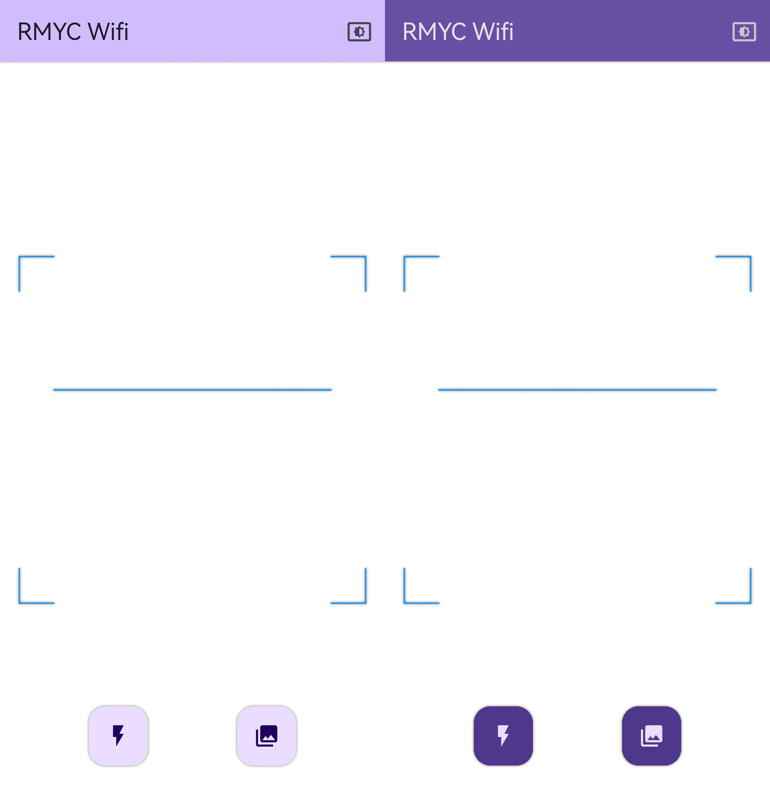

# RoboMaster Wifi 解析软件



<h1>免责声明: 此软件仅用于快速连接机器人, 严禁用于任何非法以及干扰正常比赛的用途, 开发者不为其使用者的任何用途负任何责任</h1>

## 介绍

这是一个用于解析 RoboMaster S1/EP 机器人的 Wifi 连接二维码数据的软件，可用解析出 Wifi 的 SSID, 密码等信息.

## 使用方法

### 从 Release 下载

1. 从 [Release](https://github.com/RMYC-Lab/Wifi-QR-Code-App/releases) 下载适用于您手机价格的安装包

   - `app-arm64-v8a-release` 适用于大部分新发布的安卓手机
   - `app-armeabi-v7a-release` 适用于部分老旧安卓手机
   - `app-x86_64-release` 适用于部分安卓模拟器
   - `app-release` 适用于所有安卓设备, 但包体积较大

2. 安装软件

3. 打开软件, 会自动请求相机权限, 调用摄像头.

4. 扫描二维码, 即可解析出 Wifi 的 SSID, 密码等信息. 点击二维码可用水平翻转二维码.

### 从源码编译

1. 安装 Flutter 开发环境 [参照 Flutter Docs](https://flutter.dev/docs/get-started/install)

2. Clone 本仓库

   ```bash
   git clone https://github.com/RMYC-Lab/Wifi-QR-Code-App.git
   ```

3. 进入项目目录

   ```bash
    cd Wifi-QR-Code-App/rmwifi
   ```

4. 运行

   ```bash
   flutter run
   ```

5. 打包
   ```bash
   flutter build apk
   ```
   或者分 ABI 打包
   ```bash
   flutter build apk --split-per-abi
   ```

## 界面介绍

- 主界面
  - 右上角按钮可切换 浅色/深色 主题
  - 左下角按钮可打开闪光灯
  - 右下角按钮可打开相册选取图片进行识别
  - 识别到有效二维码后自动进入二维码解析界面
- 二维码解析界面
  - 可查看解析出的信息, 包括
    - `Origin Data` 原始数据
    - `SSID` Wifi 名称
    - `Password` Wifi 密码
    - `BSSID` Wifi BSSID
    - `Port` 未知, 可能是 RoboMaster App/赛事 的端口
    - `AppID` 未知, 可能是 RoboMaster App/赛事 的 ID
  - 点击二维码可用水平翻转二维码
    > 因为 RoboMaster App/赛事 里生成的二维码对比正常的二维码 (QR Code) 多了一次水平翻转, 显示时已经过水平翻转
    >
    > 理论上二维码的内容不应该受到水平翻转的影响, 但是为了方便查看, 本软件**会自动进行水平翻转**
    >
    > 理论上水平翻转不会影响二维码的解析, 但是如果解析出的信息不正确, 可以尝试长按二维码进行水平翻转
  - 点击 `Back` 返回主界面
  - 点击 `Connect` 将会尝试连接到解析出的 Wifi, 此项功能为实验性功能, 不保证其可用性

## 贡献

欢迎提交 PR, 但请注意, 请不要提交任何违反法律法规的代码.

## License

本项目使用 GPL-3.0 协议, 请查看 [LICENSE](LICENSE) 文件.
